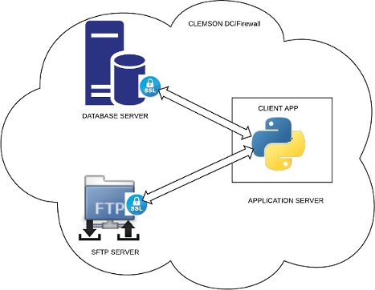
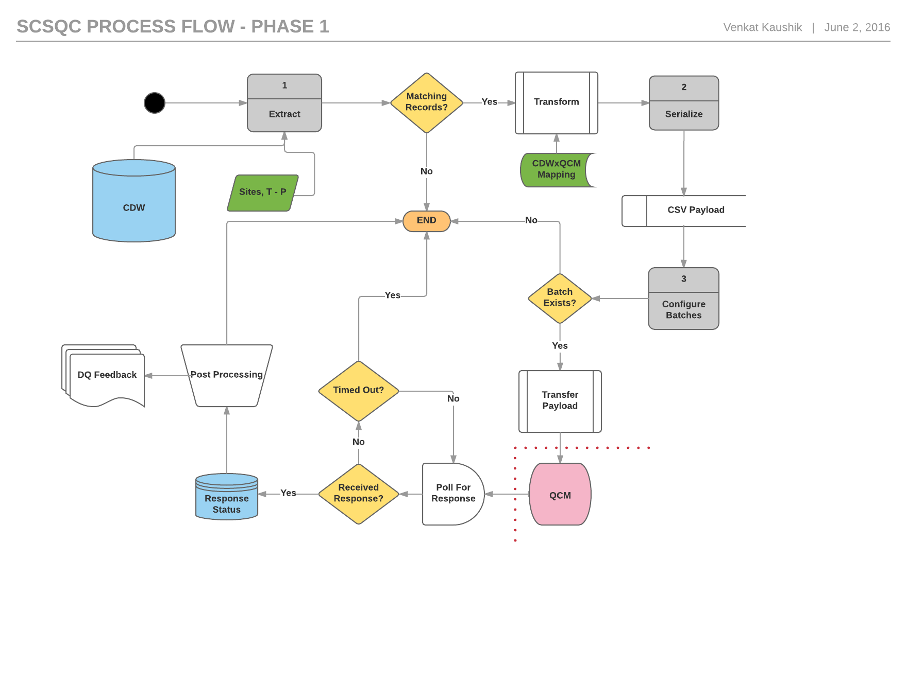

Architecture
============

The basic architectural components are a database server, an application server and
a secure FTP server which reside in a VPN at the CCIT_ data center.

.. _CCIT: http://www.clemson.edu/ccit/about/

The SQC application runs periodically on the application server and connects securely
to the database, requests the data. The extraction of data is performed by a stored
procedure in a database package. Data extracted is serialized as *csv* format
and staged to a local file on the application server. This file is securely
transmitted to the FTP server in a pre-defined location for consumption by QCMetrix
interface. 

Secure Database Access
----------------------
A secure connection is established to the database server 
using an `application principal <https://docs.oracle.com/database/121/DBFSG/users_roles.htm#DBFSG20000>`_
with access only to few database tables in a single schema. The
authentication mechanism is defined for the application user includes the following **two steps**

 1. **Client-side wallet**: a `secure software container <http://docs.oracle.com/cd/B19306_01/network.102/b14266/cnctslsh.htm#g1033548>`_ used in establishing a connection
 2. **Password authenticaiton**: `for application user <https://docs.oracle.com/database/121/DBFSG/users_roles.htm#DBFSG20000>`_ to access the schema

The application access to is further restricted by defining application 
roles for its use and granting specific privileges for SELECT, INSERT, UPDATE and EXECUTE.
This mechanism is to ensure secure and restricted access to data by the application.

Process Flow
------------
The process flow diagram for Phase 1 of the project is shown below. A single block of extract, transform, serialize and 
transfer processes occur per site based on criteria defined for extraction. Once the payload (data) is transferred to the
SFTP server, a handshake occurs, where the serialized data is picked up by the QCMetrix interface and delivered to
the nurse/surgeon lead for their use. The data pertains to surgical procedures performed for patient enounters at a given
site. The QCMetrix interface consumes this data and puts a response file. The response is processed and stored into the
database asynchronously. Reports on data exchange could be generated.

